# 🧠 MindEase

### An Android-Based Mental Wellness Journal & Mood Tracking Application

MindEase is a Java-based Android application designed to promote mental well-being through journaling, mood tracking, and personalized self-care recommendations. The application enables users to record their daily thoughts and emotions, monitor mood patterns over time, and gain meaningful insights into their mental health journey.

Built using Android Studio, Java, and Room Database, MindEase provides a secure and user-friendly platform for self-reflection and emotional awareness.

---

## ✨ Features

### 🔐 User Authentication

* Secure user registration and login system.
* Personalized user accounts.

### 📝 Digital Journal

* Create daily journal entries.
* Record thoughts, experiences, and emotions.
* View all saved journal entries.

### 😊 Mood Tracking

* Select and save mood states while journaling.
* Track emotional well-being over time.

### ✏️ Entry Management

* Edit existing journal entries.
* Delete unwanted entries.
* Maintain an organized journal history.

### 📊 Insights & Analytics

* Visualize mood trends through graphical representations.
* Identify emotional patterns and behavioral insights.

### 💡 Personalized Recommendations

* Receive wellness suggestions based on recorded moods.
* Encourage positive mental health practices.

### 👤 Profile Management

* View and manage user profile information.

### 🗄️ Local Data Persistence

* Secure local storage using Room Database.
* Efficient data retrieval through DAO architecture.

---

## 🛠️ Tech Stack

| Technology                 | Purpose                         |
| -------------------------- | ------------------------------- |
| Java                       | Android Application Development |
| Android Studio             | Development Environment         |
| XML                        | User Interface Design           |
| Room Database              | Local Data Storage              |
| Android SDK                | Mobile Application Framework    |
| RecyclerView               | Display Journal Entries         |
| Material Design Components | User Experience & UI            |

---

## 📂 Project Structure

```text
MindEase
│
├── app
│   └── src/main
│       ├── java/com.example.mentalhealthapp
│       │
│       ├── data
│       │   ├── AppDatabase
│       │   ├── User
│       │   ├── UserDao
│       │   ├── JournalEntry
│       │   └── JournalDao
│       │
│       ├── ui
│       │   ├── LoginActivity
│       │   ├── RegisterActivity
│       │   ├── HomeActivity
│       │   ├── ProfileActivity
│       │   ├── AccountActivity
│       │   ├── AddEntryActivity
│       │   ├── ViewJournalActivity
│       │   ├── InsightsActivity
│       │   ├── RecommendationActivity
│       │   └── JournalAdapter
│       │
│       └── MainActivity
│
├── res
├── AndroidManifest.xml
└── README.md
```

---

## 📸 Application Preview

### Login Screen

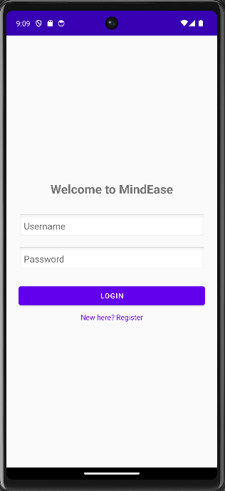

### Create Account

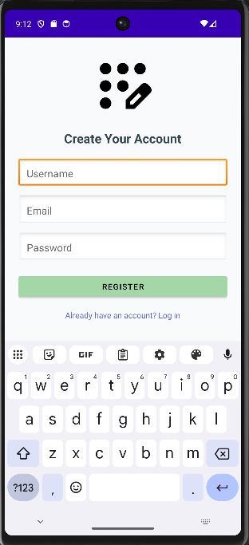

### Home Dashboard

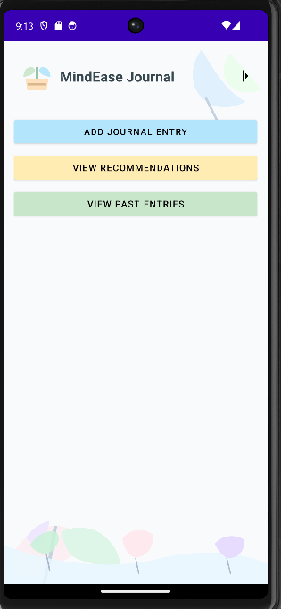

### Add Journal Entry

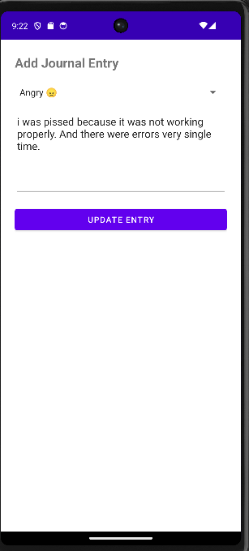

### Mood Selection

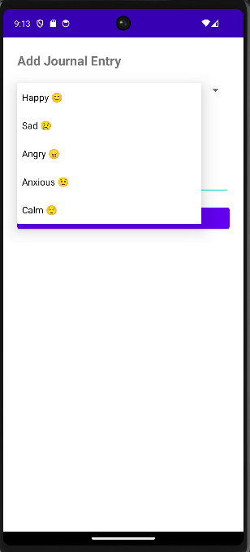

### Journal Entries

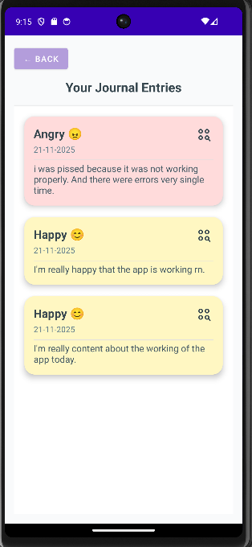

### Edit & Delete Entries

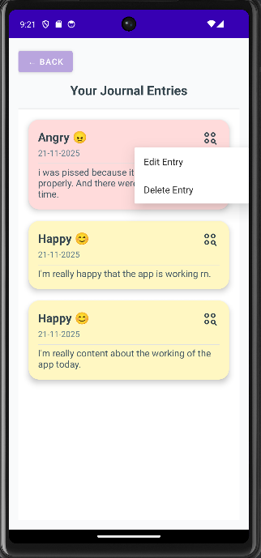

### Insights Dashboard

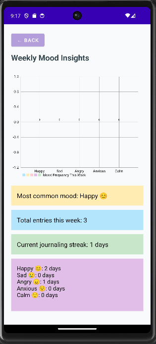

### Profile Screen

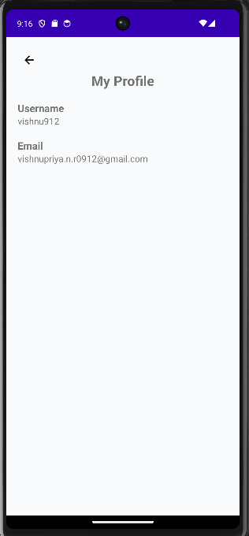

### Personalized Recommendations

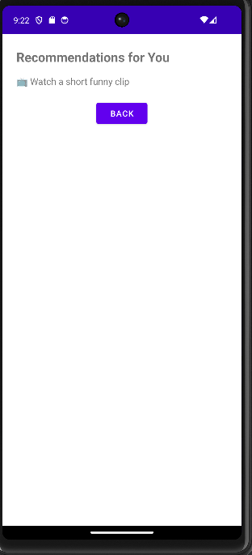

### Navigation Drawer

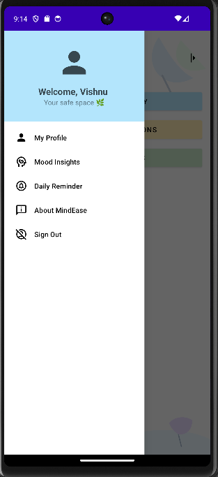

---

## ⚙️ Getting Started

### Prerequisites

* Android Studio
* Android SDK
* Java Development Kit (JDK)

### Installation

1. Clone this repository.
2. Open the project in Android Studio.
3. Sync Gradle dependencies.
4. Build and run the application on an emulator or Android device.

---

## 🚀 Future Enhancements

* AI-Powered Mood Analysis
* Mental Health Chatbot
* Daily Wellness Reminders
* Cloud Synchronization
* Password Recovery System
* Advanced Analytics Dashboard
* Dark Mode Support
* Multi-Language Support

---

## 👩‍💻 Author

**Vishnu Priya N.R.**
